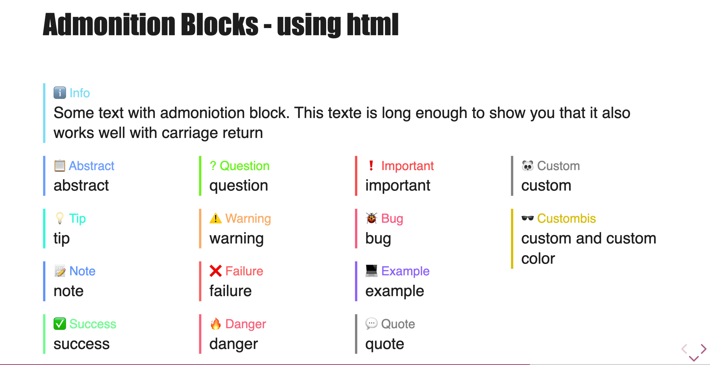
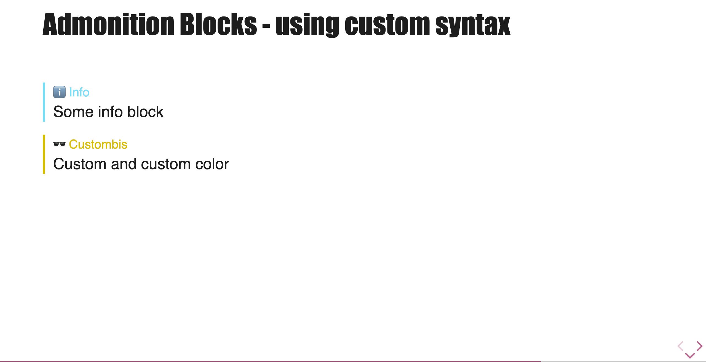

# Admonitions

Admonitions are special blocks of text that highlight information, such as notes, tips, or warnings. Talk-Control provides a simple syntax to create them in your Markdown files.

## Usage

To create an admonition, use the following syntax, starting and ending with `!!!`:

```markdown
!!! type
Your content here. It can span multiple lines.
!!!
```

-   `type`: The type of admonition you want to create.

For example:

```markdown
!!! note
This is a note. It contains some important information.
!!!
```

This will be rendered as a styled block with a "📝 Note" title.

## Available Types

Here is a list of the pre-configured admonition types you can use:

| Type        | Rendered Title |
| ----------- | -------------- |
| `abstract`  | 📋 Abstract    |
| `info`      | ℹ️ Info        |
| `tip`       | 💡 Tip         |
| `note`      | 📝 Note        |
| `success`   | ✅ Success     |
| `question`  | ? Question     |
| `warning`   | ⚠️ Warning     |
| `failure`   | ❌ Failure     |
| `danger`    | 🔥 Danger      |
| `important` | ❗ Important   |
| `bug`       | 🐞 Bug         |
| `example`   | 💻 Example     |
| `quote`     | 💬 Quote       |



## Custom Admonitions

If the predefined types don't fit your needs, you can create a custom admonition.

### Custom Title and Icon

Use the `custom` type and provide a title/icon using the `tc-admonition-type` attribute.

```markdown
!!! custom tc-admonition-icon="🐼 Panda Facts"
Pandas are native to central China.
!!!
```

### Custom Color

You can also specify a custom color for the left border and the title using the `tc-admonition-color` attribute. The value should be a valid CSS color.

```markdown
!!! custom tc-admonition-type="🕶️ Custom" tc-admonition-color="#d7be00"
Custom and custom color
!!!
```



## Use comment syntax

To use revealJS comment syntax you can use the following code

```md
Some info block

<!-- .element: class="admonition info" -->

Custom and custom color

<!-- .element: class="admonition custom" data-admonition-icon="🕶️ Custom" style="--tc-admonition-bg-color:#d7be00;" -->
```
