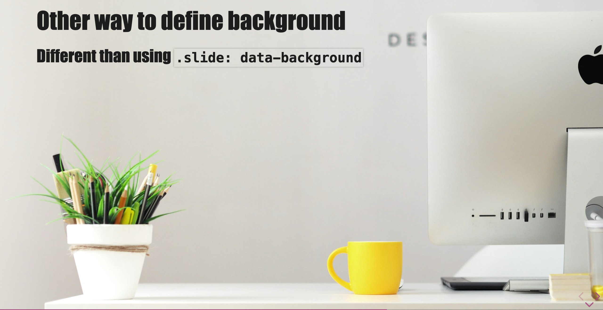
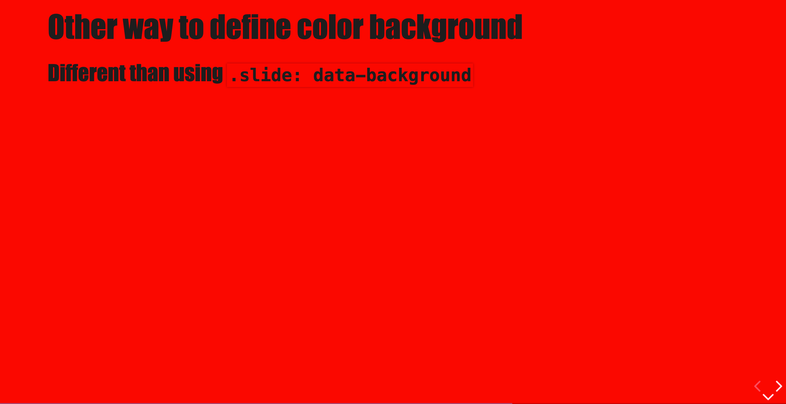
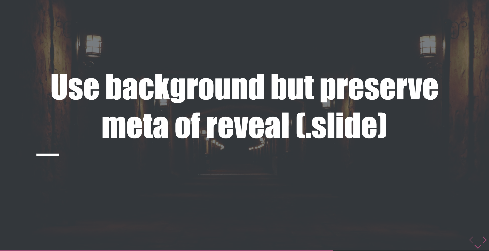

# Backgrounds helpers

In addition to the "revealJS way" to set a background for a slide (`<!-- .slide: data-background="...." -->`), you can use a new syntax:

```md

```



You can also use colors (color name, rgb, hash)

```md

```



This will preserve classes put on the slide element:

```md
<!-- .slide: class="mask transition" -->

# Use background but preserve meta of reveal (.slide)


```


