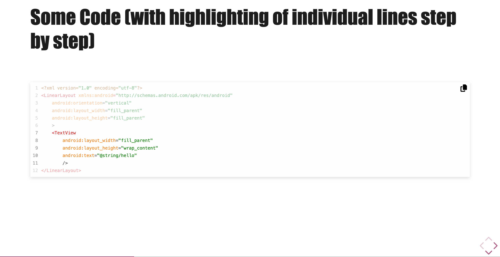
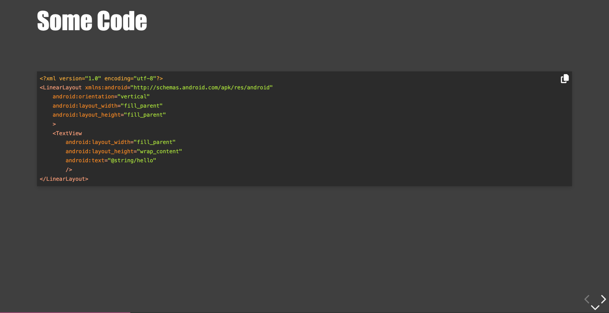
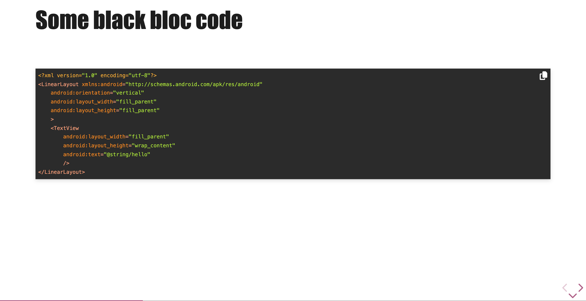
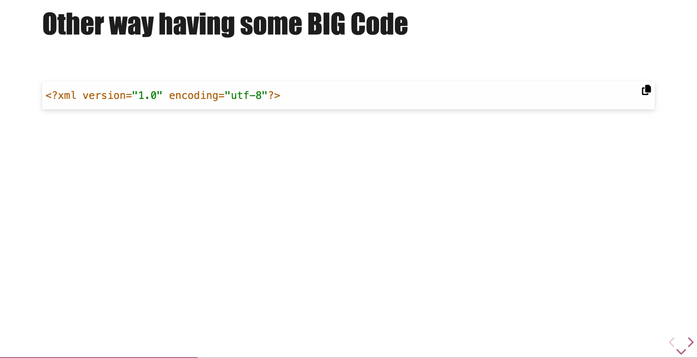
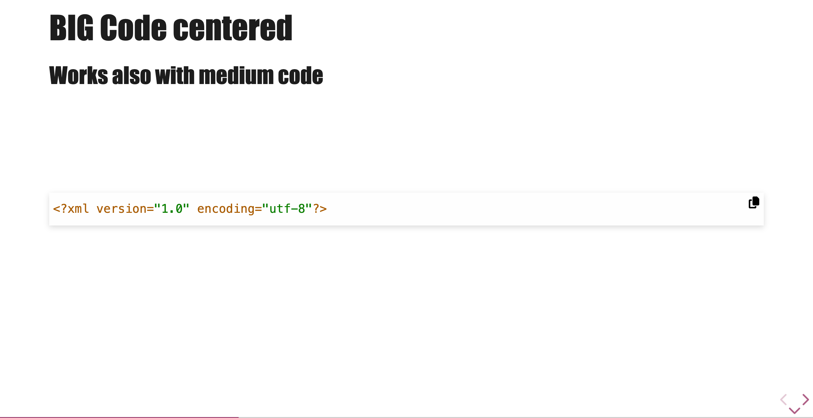

# Slide with code

In addition to what RevealJS offers : [RevealJS code features](https://revealjs.com/code/)

Default theme applyed by TalkControl is `a11y-light`;



## Switch to dark background slides

In this mode, the theme applyed is `a11y-dark`



## Light slide with dark code background

In this mode, the theme applyed is `a11y-dark`



## Copy to clipboard

TalkControl comes with a copy to clipboard icon that includes in clipboard the content of code slide.

/!\ This will work only if you have define an icon library to use (see [icons](./icons.md))

### Configuration

The first icon library you passed in the `ThemeInitializer.init` method will be used.

```javascript
tcMarkedOptions: {
    fontIcons: [
        fontAwesomeIconPack(),
        featherIconPack(),
    ],
},
```

Here, the copy icon of FontAwesome will be used.

### Desactivation

You can desactiv this behaviour by simply setting to `false` the option `activeCopyClipboard` in `ThemeInitializer.init` method. Default value is `true`

## Size of your code

You can choose between 2 font-size for your code : medium or big. Medium is the default size (screenshot).

### Force Big code

To force big size, simply suffix your code with class "big-code"

````md
<!-- .slide: class="with-code" -->

## Some BIG Code

```xml
<?xml version="1.0" encoding="utf-8"?>
```

<!-- .element: class="big-code" -->
````



### Force Medium code

To force big size, simply suffix your code with class "medium-code"

````md
<!-- .slide: class="with-code" -->

## Some BIG Code

```xml
<?xml version="1.0" encoding="utf-8"?>
```

<!-- .element: class="medium-code" -->
````

### Change default size

By default the size of your code is "medium" if you prefer having only "big" code by default, simply define at the top of your css the custom properties like this:

```css
body {
    --tc-code-font-size: var(--tc-big-code-font-size);
    --tc-code-line-height: var(--tc-big-code-line-height);
}
```

### Change the sizes

There are custom properties defined to fix the size of your code. You can look at the code section [here](../src/scss/theme/talk-control-custom-properties.scss)

## Displaying more lines on screen

By default there will be only 20 lines of code displayed. If you need more space, you could use the class `max-height` that will increase the number of lines to 30 lines.

````md
<!-- .slide: class="with-code-dark max-height" -->

## Some Code with lots of code

```xml
<?xml version="1.0" encoding="utf-8"?>
<LinearLayout xmlns:android="http://schemas.android.com/apk/res/android"
    android:orientation="vertical"
    android:layout_width="fill_parent"
    android:layout_height="fill_parent"
    >
    <TextView
        android:layout_width="fill_parent"
        android:layout_height="wrap_content"
        android:text="@string/hello"
        />
    <TextView
        android:layout_width="fill_parent"
        android:layout_height="wrap_content"
        android:text="@string/hello"
        />
    <TextView
        android:layout_width="fill_parent"
        android:layout_height="wrap_content"
        android:text="@string/hello"
        />
    <TextView
        android:text="@string/hello"/>
</LinearLayout>
```
````

## Center your code on slide

It often arrived that you only display one code block on screen and you it to be center. To do this, add the class `alone` to the code block

````md
<!-- .slide: class="with-code big-code" -->

## BIG Code centered

### Works also with medium code

```xml
<?xml version="1.0" encoding="utf-8"?>
```

<!-- .element: class="alone" -->
````



This will only work if you have one code block!

## Changing default font applyed

If you don't like `a11y-light` and `a11y-dark`, you can specify an other font, you will have to override fonts with css like this:

```css
.with-code {
    @import '../../../../node_modules/highlight.js/scss/atom-one-light.scss';
}
.with-code-dark,
.with-code-bg-dark {
    @import '../../../../node_modules/highlight.js/scss/atom-one-dark.scss';
}
```

Think after to also override the color of dark slides because it could not match... Just define this custom properties `--tc-code-dark-background`, the default value is `#3f3f3f`
