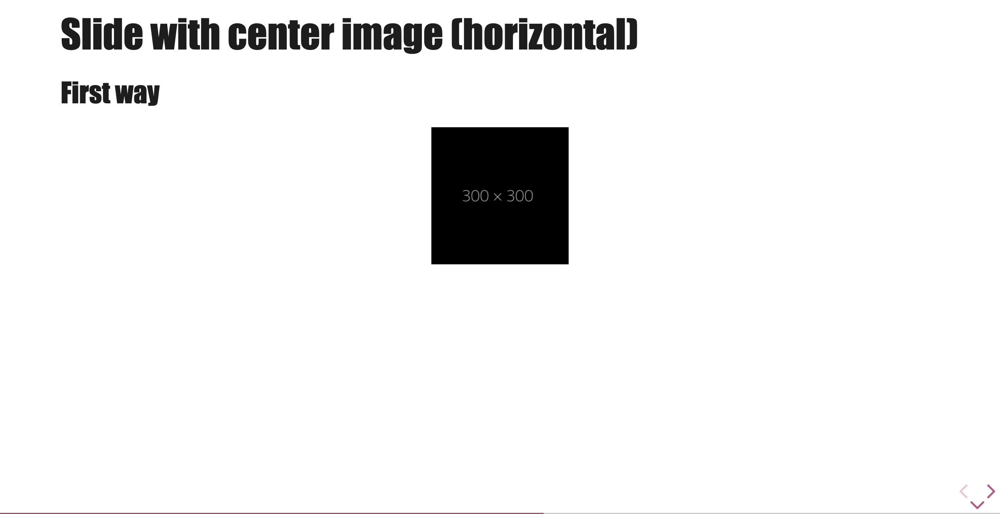
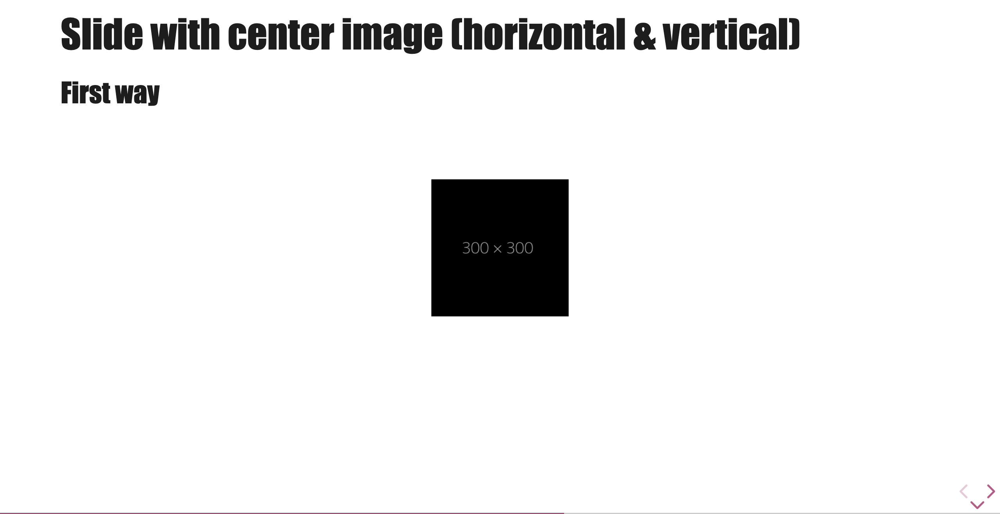
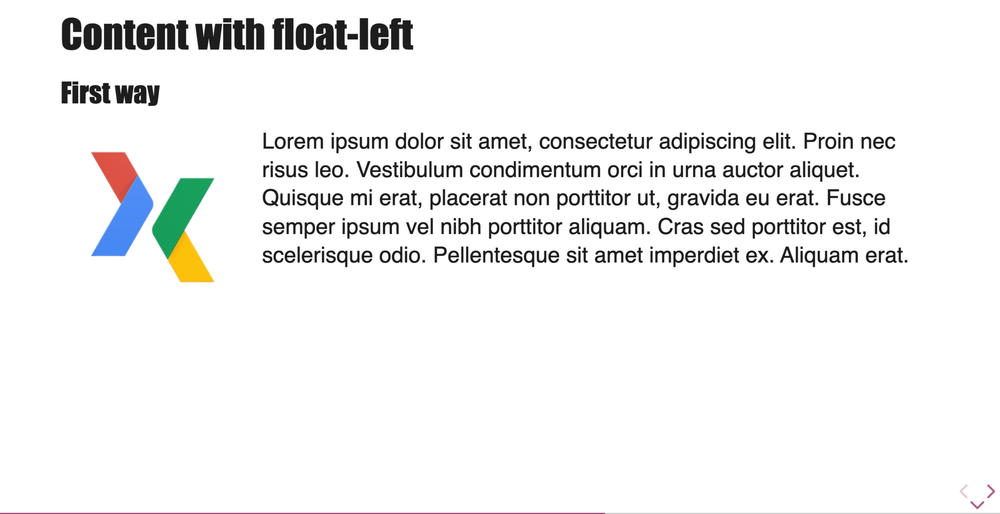
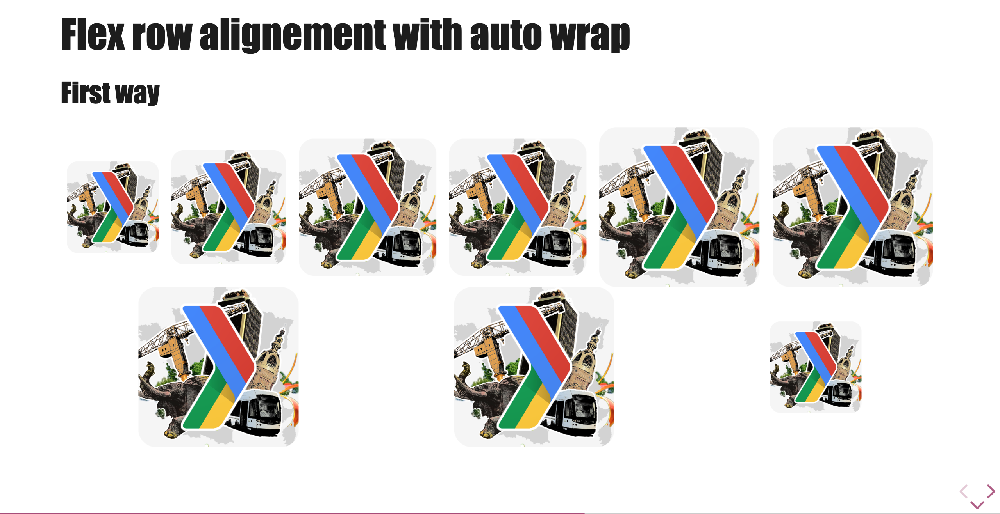
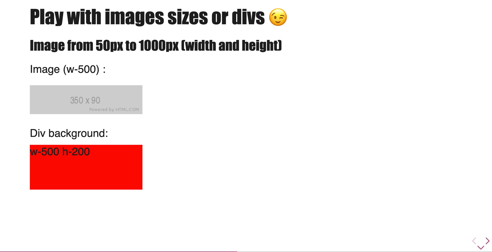
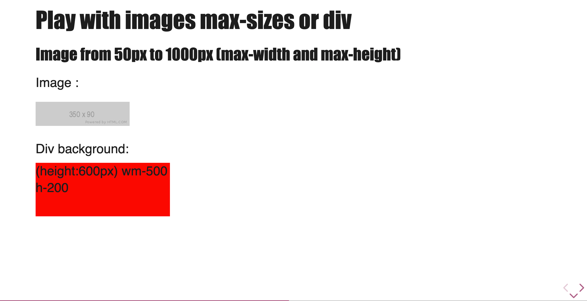
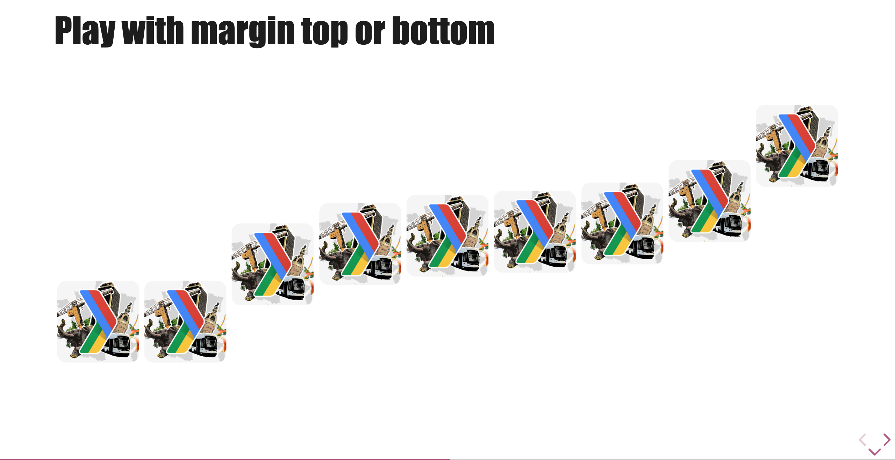
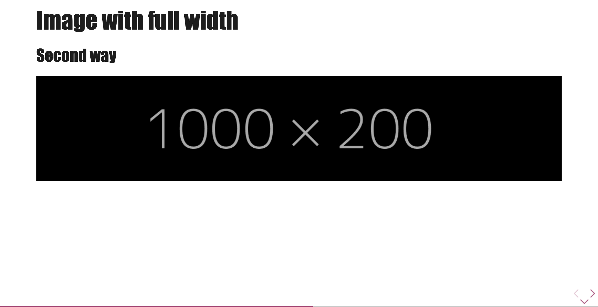
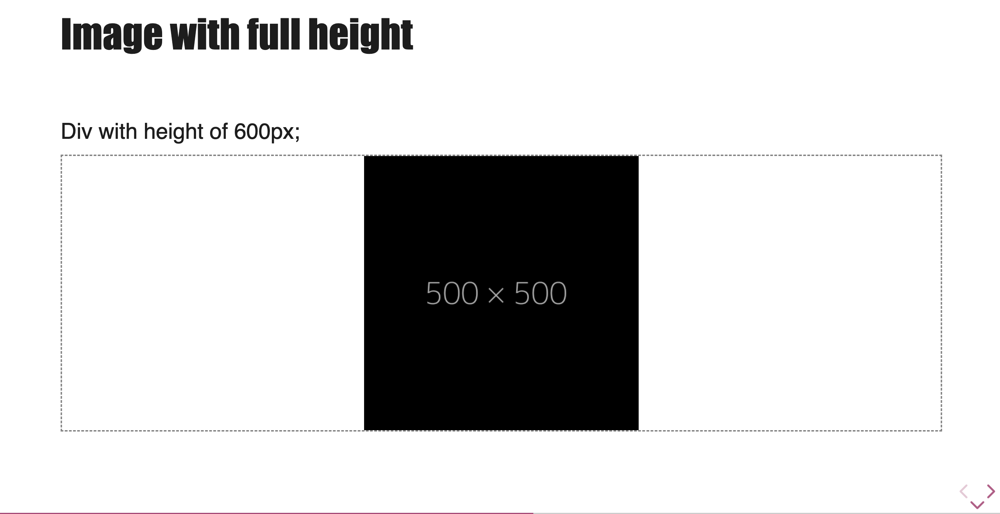

# Helpers

Talk-Control provides a set of CSS helper classes to easily control the layout, sizing, and behavior of elements within your slides. These can be applied to images, text blocks, and other elements using Markdown attributes.

## Layout Helpers

These classes help you position elements on your slide.

| Class          | Description                                                                              |
| -------------- | ---------------------------------------------------------------------------------------- |
| `.center`      | Centers an element horizontally.                                                         |
| `.float-left`  | Floats an element to the left, allowing text to wrap around its right.                   |
| `.float-right` | Floats an element to the right, allowing text to wrap around its left.                   |
| `.full-center` | Centers a block both horizontally and vertically. Ideal for a single element on a slide. |
| `.flex-row`    | Arranges direct child elements in a row with space around them.                          |

### Examples

**Center horizontally an image:**

```markdown

```



**Center horizontally and vertically an image:**

```markdown

```



**Float an image to the left of some text:**

```markdown


Lorem ipsum dolor sit amet, consectetur adipiscing elit. Proin nec risus leo. Vestibulum condimentum orci in urna auctor aliquet. Quisque mi erat, placerat non porttitor ut, gravida eu erat. Fusce semper ipsum vel nibh porttitor aliquam. Cras sed porttitor est, id scelerisque odio. Pellentesque sit amet imperdiet ex. Aliquam erat.
```



**Use flex-row positionning:**

```md
<div class="flex-row">


</div>
```

or

```md
<!-- .slide: class="flex-row" -->


```



## Sizing Helpers

Control the dimensions and margins of your elements.

| Class          | Description                                                               |
| -------------- | ------------------------------------------------------------------------- |
| `.full-width`  | Makes an element span the full width of its container.                    |
| `.full-height` | Makes an element span the full height of its container.                   |
| `.w-[size]`    | Sets a fixed width. `[size]` is a value from 50 to 1000 in steps of 50.   |
| `.h-[size]`    | Sets a fixed height. `[size]` is a value from 50 to 1000 in steps of 50.  |
| `.wm-[size]`   | Sets a `max-width`. `[size]` is a value from 50 to 1000 in steps of 50.   |
| `.hm-[size]`   | Sets a `max-height`. `[size]` is a value from 50 to 1000 in steps of 50.  |
| `.mt-[size]`   | Sets `margin-top`. `[size]` is a value from 10 to 1000 in steps of 10.    |
| `.mb-[size]`   | Sets `margin-bottom`. `[size]` is a value from 10 to 1000 in steps of 10. |

### Example

**An image with a fixed width and a fixed height:**

```markdown
Image (w-500) :


Div background:

<div style="background:red;" class="w-500 h-200"> w-500 h-200</div>
```



**An image with a max fixed width and a max fixed height:**

```markdown
Image :


Div background:

<div style="background:red; width:600px;" class="wm-500 h-200"> (height:600px) wm-500 h-200</div>
```



**Play with top and bottom margins:**

```md


```



**Force image to take all the width:**

```md

```



**Force image to take all the height:**

```md
<div style="height:600px; width:100%; border: dashed 3px grey;">
    
</div>
```



## List Fragments

To make every item in a list appear one by one (as fragments), you don't need to add `.fragment` to every `<li>`. Instead, just add the `.list-fragment` class to the end of list items. Talk-Control will automatically apply the `.fragment` class to all `<li>` elements in that list.

### Example

```markdown
-   First item
-   Second item
-   **Third item**
-   Fourth item
<!-- .element: class="list-fragment" -->
```

This works for both ordered (`<ol>`) and unordered (`<ul>`) lists.

## Apply Custom style to your image

Due to the syntax of image ``, if you want to add a class to your image, you have to use this syntax:

```md
<!-- .element: class="custom-img-style" -->
```

this will add class 'custom-img-style' to the image.

Now, we integrate in TalkControl the possibility to directly add classes attributes in image declaration

```md

```

To use this syntax, you have to indicate to ThemeInitialiazer method the class you integrate to help the engine to analyse it:

```javascript
tcMarkedOptions: {
    //...
    knowStyles: ['custom-img-style'],
},
```

If you don't add this, it won't work with the new custom syntax
