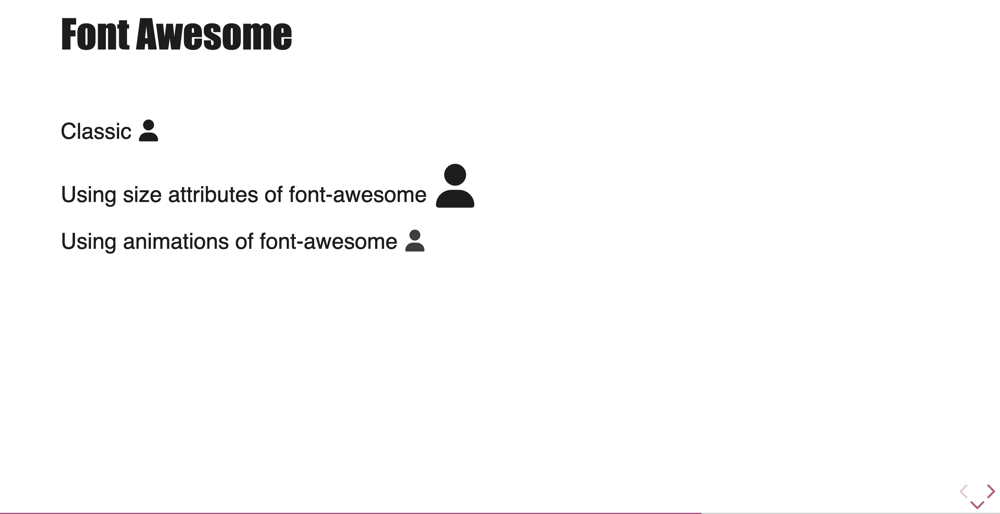
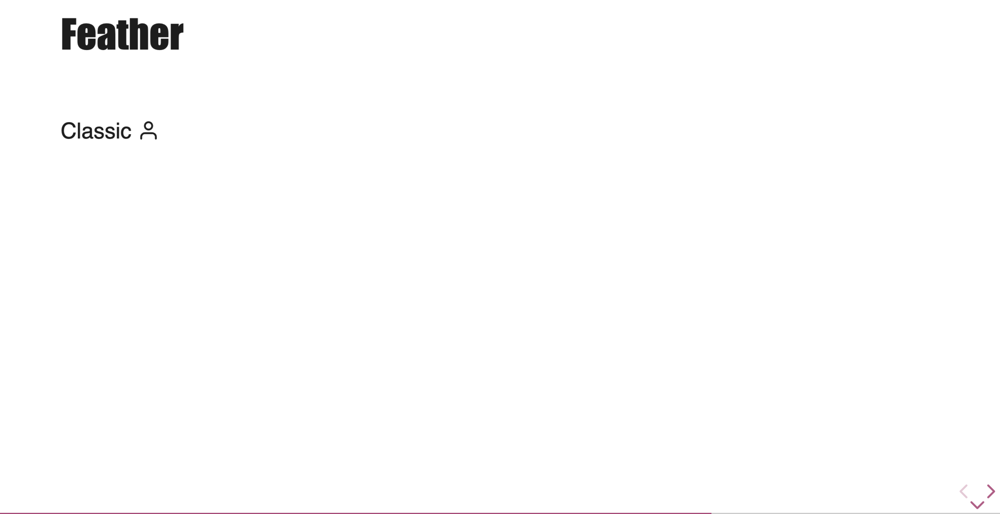
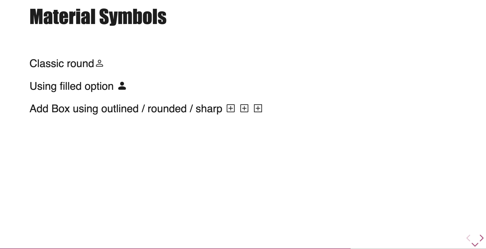
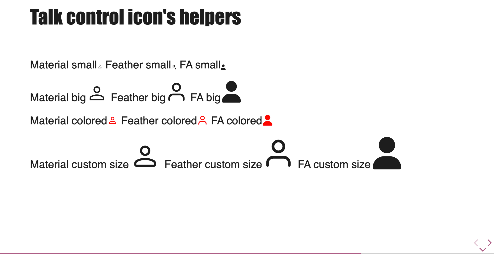

# Icons

Talk-Control allows you to easily integrate vector icons from your favorite libraries into your presentations. Three libraries are pre-configured: Font Awesome, Feather Icons, and Material Symbols.

## Configuration

To use one or more icon libraries, you must declare them in the `ThemeInitializer.init` method within the `tcMarkedOptions` object.

You need to import the desired icon pack and pass it to the `fontIcons` array.

```javascript
import {
    ThemeInitializer,
    fontAwesomeIconPack,
    featherIconPack,
} from 'talk-control-revealjs-extensions';

ThemeInitializer.init({
    // ... other options
    tcMarkedOptions: {
        fontIcons: [
            fontAwesomeIconPack(),
            featherIconPack(),
            materialSymbolsIconPack(),
        ],
    },
});
```

The order is important. The first library in the array will be used for internal features, like the "copy to clipboard" icon for code blocks. In the example above, the Font Awesome copy icon will be used.

## Usage in Markdown

Once configured, you can add an icon anywhere in your markdown content using a syntax similar to images:

``

-   `icon-name`: The specific name of the icon in the library.
-   `tc-icons`: A mandatory keyword to indicate that you want to display an icon.
-   `keyword`: The specific keyword for the icon library you want to use.

### Font Awesome

-   **Keyword**: `fa`
-   **Website**: fontawesome.com

To use a Font Awesome icon, use the `fa` keyword. You can include the style (e.g., `fa-solid`, `fa-brands`) in the icon name.

```markdown
This is a house icon: 
```



### Feather Icons

-   **Keyword**: `feather`
-   **Website**: feathericons.com

```markdown
Here is a circle: 
```

Feather icons are rendered using JavaScript. The necessary initialization is handled automatically by Talk-Control.



### Material Symbols

-   **Keyword**: `material-symbols`
-   **Website**: fonts.google.com/icons

```markdown
An account icon: 
```



## Styling Icons

You can easily style icons by adding helper classes or using CSS custom properties.

### Size

Two helper classes are available to quickly change an icon's size:

-   `.tc-small`: Makes the icon smaller.
-   `.tc-big`: Makes the icon larger (2x the default size).

```markdown
A big heart: 
```

### Custom Styling

You can override the following CSS custom properties to fine-tune the appearance of your icons:

-   `--tc-icon-size`: The icon size (e.g., `3em`, `48px`).
-   `--tc-icon-color`: The icon color.

```css
.reveal .slides section {
    --tc-icon-color: #a64d79;
    --tc-icon-size: 1.5em;
}
```



## "Copy to Clipboard" Icon

As mentioned in the Code documentation, Talk-Control adds a "copy to clipboard" button to code blocks. The icon for this button is taken from the **first** icon library you declare in your configuration.

Each pre-configured pack has a specific icon for this:

-   **Font Awesome**: `fa-copy`
-   **Feather Icons**: `copy`
-   **Material Symbols**: `content_copy`

If you provide `fontAwesomeIconPack()` first, the `fa-copy` icon will be used.

## Adding Your Own Icon Library

You can extend Talk-Control to support any icon library you'd like. This involves creating a configuration "pack" and registering it.

### 1. Create a Configuration Pack

A configuration pack is a function that returns an object with the structure `MarkedTcIconsOptions`. This object tells Talk-Control how to render your icons.

Let's create a pack for a hypothetical library called "LineIcons".

```javascript
// my-line-icons-pack.js
export function lineIconsPack() {
    return {
        // The keyword to use in Markdown: 
        keyword: 'line-icons',

        // The name of the icon for the "copy to clipboard" button
        copyKeyword: 'lni-copy',

        // The HTML attribute to use for the icon. For many libraries, this is 'class'.
        htmlAttribute: 'class',

        // Should the keyword itself be added to the class?
        // e.g., <i class="line-icons lni-heart tc-icons"></i>
        includesKeyword: true,

        // Is the icon name placed inside the tag? (default: false)
        // e.g., <i class="material-symbols tc-icons">home</i>
        iconInTag: false,

        // Is there a JS function to call after rendering? (e.g., feather.replace())
        initFunction: null, // or () => { someInitCode(); }
    };
}
```

### 2. Include Library Assets

Make sure you include the CSS and/or JavaScript files for your icon library in your project. You can do this via an `import` in your main JavaScript file or by adding `<link>` and `<script>` tags to your `index.html`.

```javascript
// In your main JS file
import 'path/to/your/line-icons.css';
```

### 3. Register the New Pack

Finally, import your new pack function and add it to the `fontIcons` array in your `ThemeInitializer.init` configuration.

```javascript
import {
    ThemeInitializer,
    fontAwesomeIconPack,
} from 'talk-control-revealjs-extensions';
import { lineIconsPack } from './my-line-icons-pack.js'; // Import your new pack

ThemeInitializer.init({
    // ... other options
    tcMarkedOptions: {
        fontIcons: [
            fontAwesomeIconPack(),
            lineIconsPack(), // Add your new pack here
        ],
    },
});
```

Now you can use your new icons in Markdown: `!`
