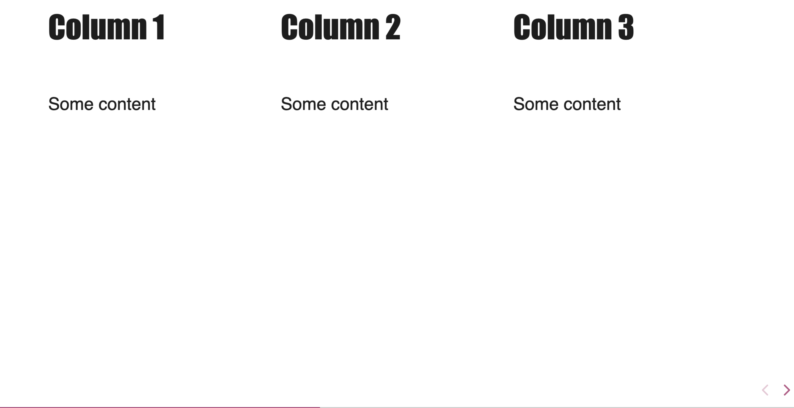
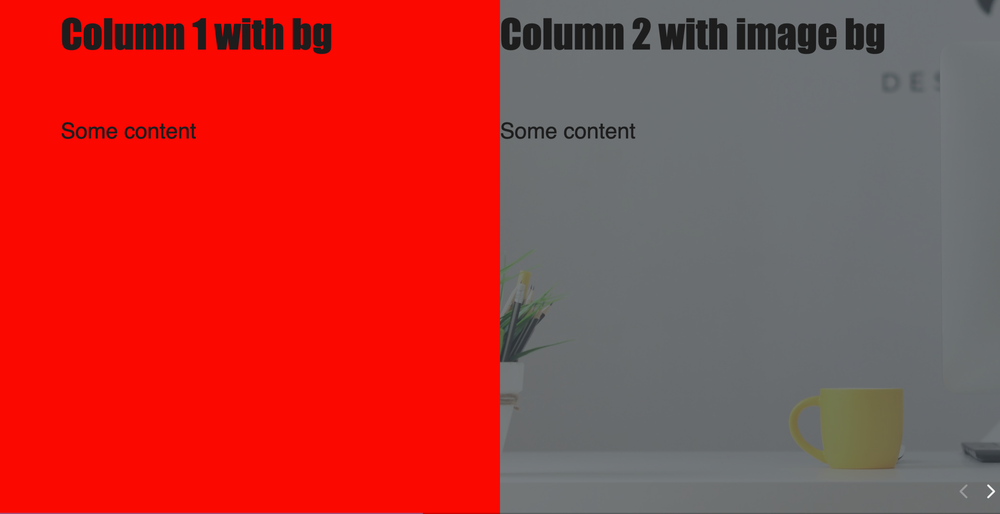
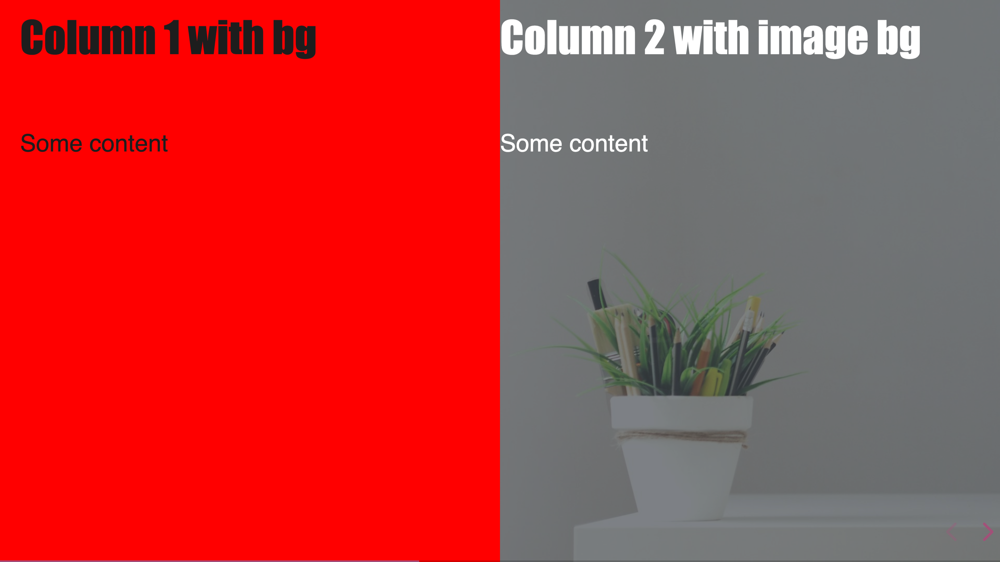

# Different Layout

For the moment, you have the possibility to have multiple columns for displaying informations.

## Multiple column layout

Due to some "magic" done by RevealJS engine, it's recommended to not use multiple columns with vertical slides.

Multiple columns with background and vertical slides won't work.

Also, only colors and image background are allowed in multiple columns !

A new syntax has to be used

````md
<!-- .slide: class="tc-multiple-columns" -->

##++##

# Column 1

Some content

##++##

##++##

# Column 2

Some content with code

##++##

##++## class="with-code"

# Column 3

Some content with code

```xml
<?xml version="1.0" encoding="utf-8"?>
```

##++##
````



### Multiple column layout (with background)

```md
<!-- .slide: class="tc-multiple-columns" -->

##++## data-background="red"

# Column 1 with bg

Some content

##++##

##++## data-background="./assets/images/light_background.jpg" class="mask"

# Column 2 with image bg

Some content

##++##
```



### Multiple column layout (with inverted contrast)

If sometimes you need inverted colors for a slide in this configuration, use the class `contrast-opposite`. And if you need to customize the colors, there is 3 custom properties available:

```scss
--tc-multiple-col-heading-color: var(--tc-heading-color);
--tc-multiple-col-color: var(--r-main-color);
--tc-multiple-col-link-color: var(--r-link-color);
```

```md
<!-- .slide: class="tc-multiple-columns" -->

##++## data-background="red"

# Column 1 with bg

Some content

##++##

##++## data-background="./assets/images/light_background.jpg" class="mask contrast-opposite"

# Column 2 with image bg

Some content

##++##
```



Each column is a div, but you can use helpers class in it.
