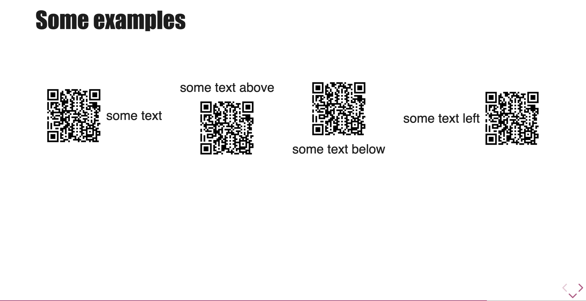

# QR Codes

Talk-Control provides a convenient way to generate and display QR codes directly within your slides. This is perfect for sharing links, contact information, or any other text-based data with your audience.

## Usage

To generate a QR code, use a syntax similar to an image, but with the `tc-qrcode` keyword in the title.

```markdown
 some text
```

-   `text-to-encode`: The data you want the QR code to contain. This is typically a URL.
-   `tc-qrcode`: The mandatory keyword that triggers the QR code generation.
-   `some text`: the 'legend' text associated
-   the part with `tc-qrcode` will arrive in class attribute, so you can add several classes in it

by default the size of QrCode is 500px square

## Layout with Text

You can easily display text alongside your QR code. By default, the text will appear to the right of the image.
To control the position of the text relative to the QR code by adding layout classes :

-   `.text-left` class to place the text to the left of the QR code.
-   `.text-below` class to place the text underneath the QR code.
-   `.text-above` class to place the text above the QR code.

```markdown
 some text

 some text above

 some text below

 some text left
```


