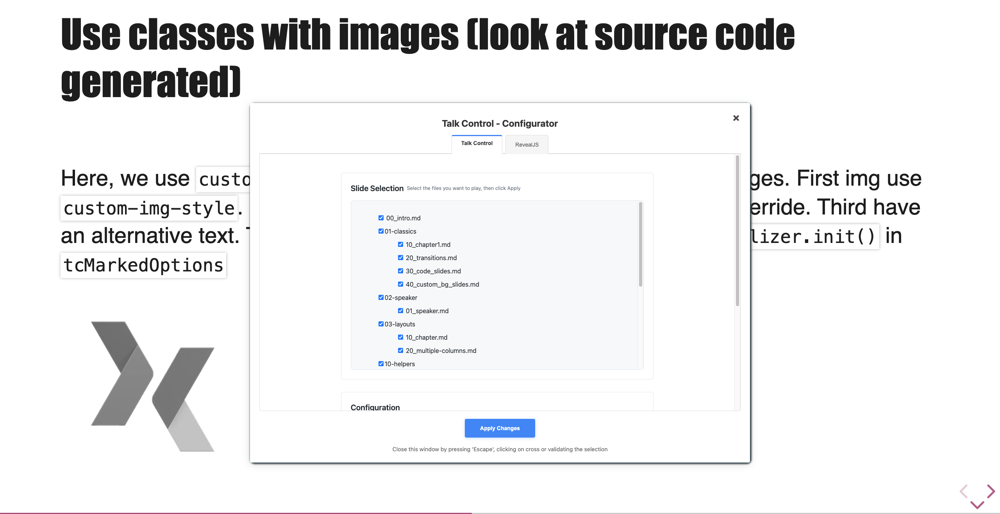

# Create content for the configuration like distribution

With this configuration option you can easily create content that is different between, what you will play on stage and what you will give to your attendees without a complete rewrite of your slides. This configuration is a pairing between a key specified in your index.html or URL parameters and a key present in your slides.

**Index.html Configuration**

```html
<body>
    <div class="reveal">
        <div class="slides" data-type="on-stage">...</div>
    </div>
</body>
```

https://talk-control-revealjs-extensions.netlify.app/index.html?data-type=on-stage#/

**Slides configuration**

```markdown
<!-- .slide: data-type-show="on-stage" -->

## A slide for presentation only

A few words !
```

The slide 'A slide for presentation only' will be visible only if the attribute `data-type` on index.html is set to "on-stage" or if the type URL parameter is set to "on-stage".
Note that as for the themes described above, the URL parameter takes precedence over the HTML attribute.

With this technique, you can easily create 2 versions of your index.html, one with `data-type-show` to **on-stage** and one with `data-type-show`to **full** and in your slides, you have something like that

```markdown
<!-- .slide: data-type-show="on-stage" -->

## A slide for presentation only

A few words !

##==##

<!-- .slide: data-type-show="full" -->

## A slide for publication only

Lorem ipsum dolor sit amet, consectetur adipiscing elit. Proin nec risus leo. Vestibulum condimentum orci in urna auctor aliquet. Quisque mi erat, placerat non porttitor ut, gravida eu erat. Fusce semper ipsum vel nibh porttitor aliquam. Cras sed porttitor est, id scelerisque odio. Pellentesque sit amet imperdiet ex. Aliquam erat.
```

If nothing is set in the markdown, the slide will be available for both versions.

You can also set multiple data-type-show in the same slide (separated by a space) to create kind of specifics configurations for your slides.

```markdown
<!-- .slide: data-type-show="on-stage other" -->
```

## Parameter given to slide factory

This parameter is also given to slideFactory function of ThemeInitializer. This can help you "configuration" your slides.

```javascript
function formation(showType) {
    return [
        //
        ...schoolSlides(),
        ...(!showType || showType === 'on-stage' || showType === 'speakers'
            ? speakerSlides()
            : []),
        ...(!showType || showType === 'on-stage' || showType === 'layouts'
            ? layoutsSlides()
            : []),
        ...(!showType || showType === 'on-stage' || showType === 'helpers'
            ? helpersSlides()
            : []),
        ...(!showType || showType === 'on-stage' || showType === 'tools'
            ? toolsSlides()
            : []),
    ]
        .filter((element) => element !== undefined)
        .map((slidePath) => {
            return { path: slidePath };
        });
}
```

# UI to select and configure your slides

To select the slides to display, you have to give to the initializer a function that will return an array of objects, each with a path to a slide. So to choose your slide, you normally return 'only' the selected slides.

You can also use the 'Slide selector' UI to select your slides. To do this, hit the 'c' key when you presentation is loaded. You will see a modal with all the slides available. You can select the slides you want to display and click on the 'Validate selection' button. Only the selected path will be displayed.

The selection is stored in session storage so if you reload the page, the selection will be kept. But if you close the window or tab, the selection will be lost.

This UI will let you also configure the theme (institute / school / conf), the language (FR / EN) and the type (presentation / full / ...).


