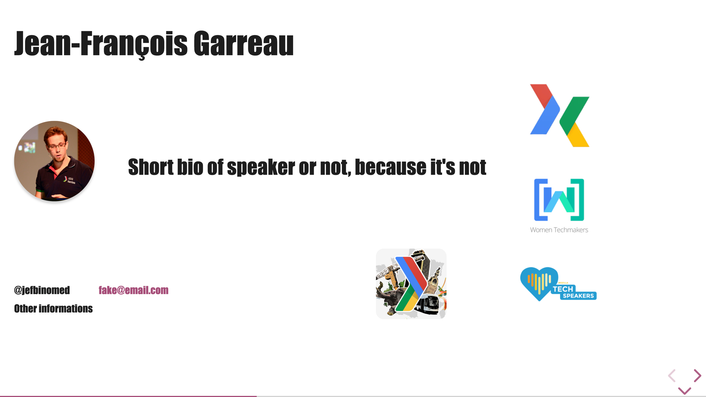
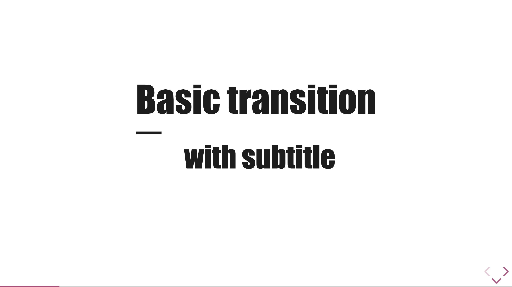
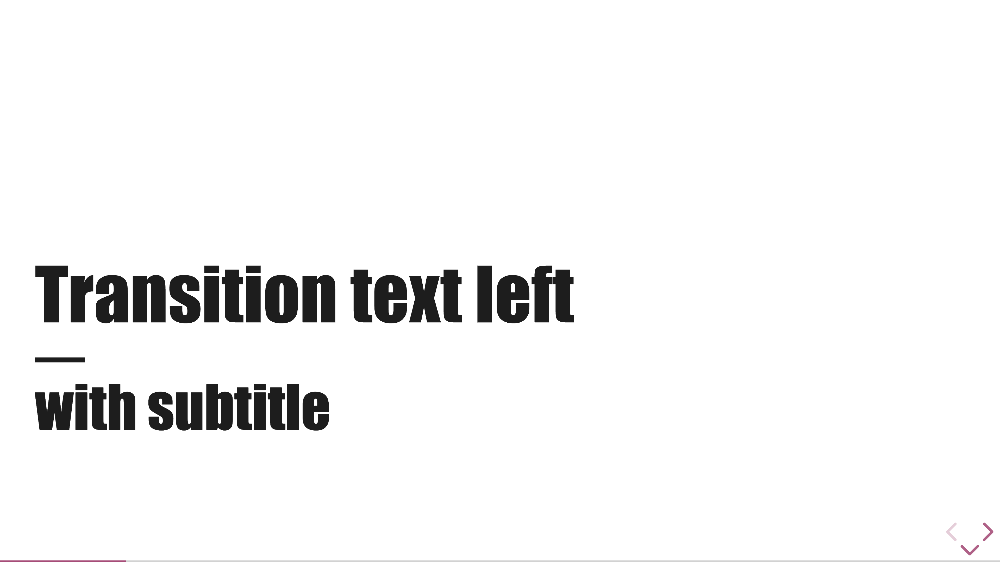
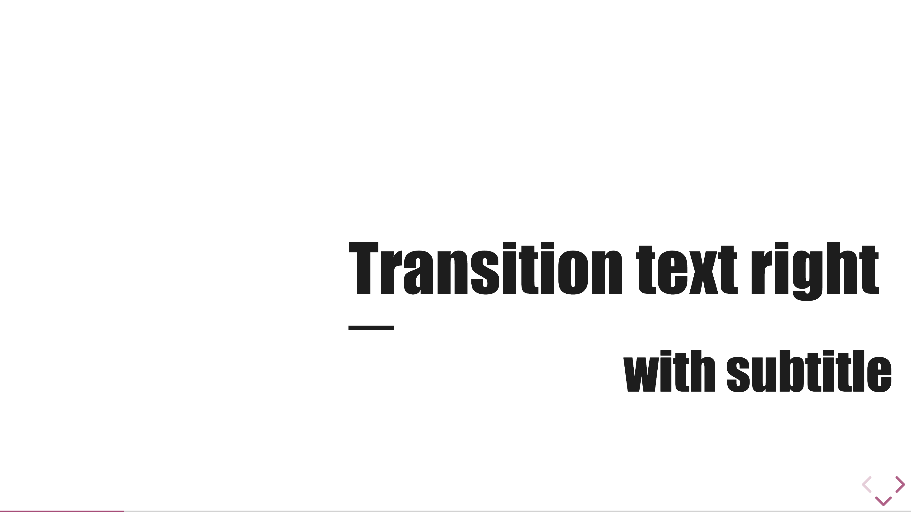
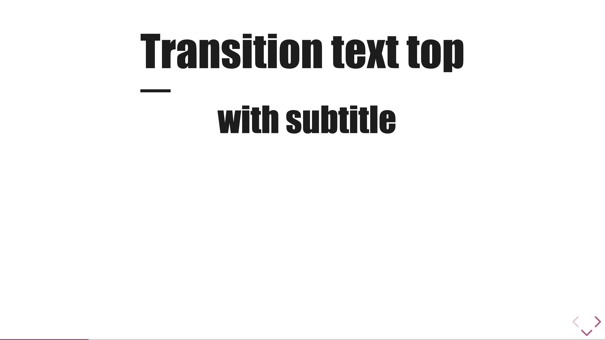
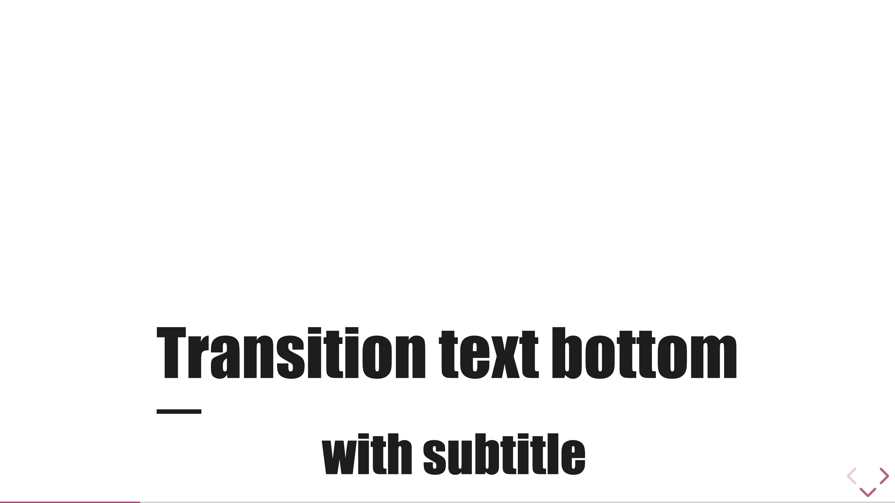
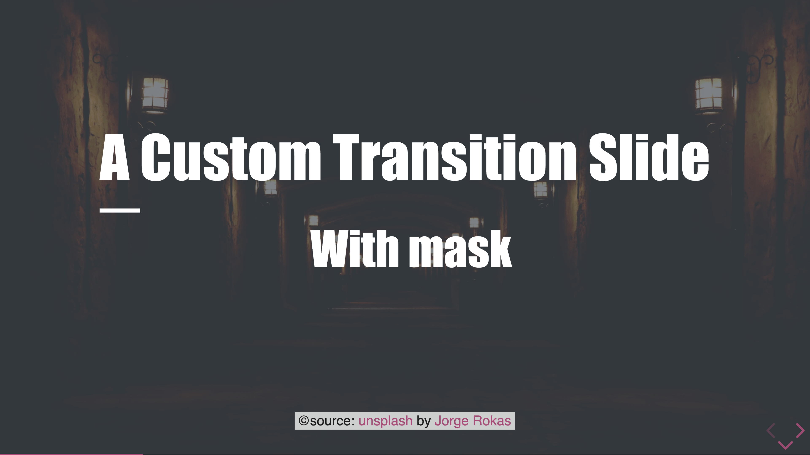
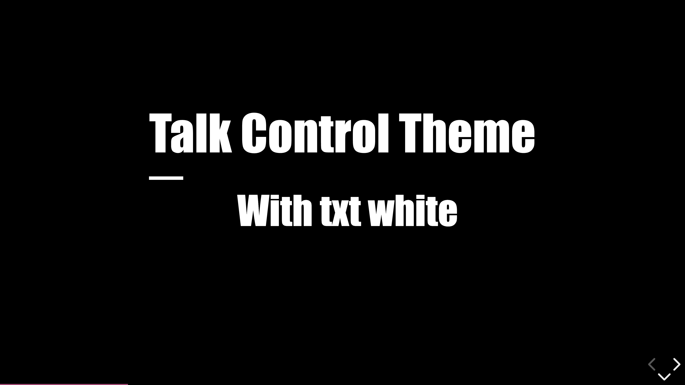
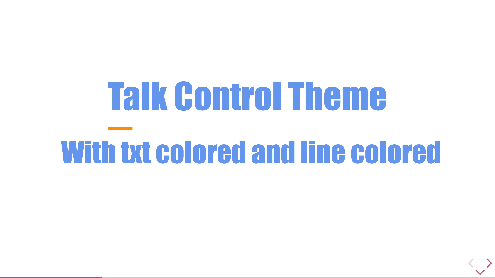
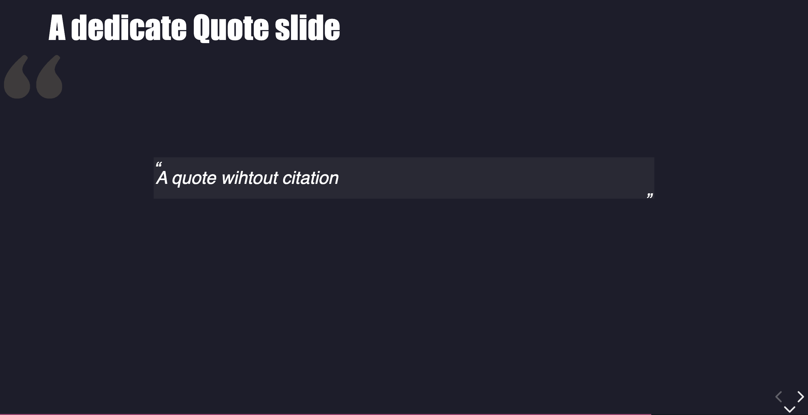

# Specifics Slides

## Speaker Slide

2 Configuration of speaker slides exist

### One speaker

```md
<div class="speaker-slide">

# Jean-François Garreau

## Short bio of speaker or not, because it's not

### @jefbinomed

### fake@email.com

### Other information

<!-- .element: class="speaker" -->

<!-- .element: class="company" -->

<!-- .element: class="badge" -->

<!-- .element: class="badge" -->

<!-- .element: class="badge" -->

</div>
```



You can also change the order of sub information (here CTO Front & @jefbinomed). You can set up to 6 sub information : each one is a `<h3>` element

You can also change the number of badge (up to 6). Each should have `class='badge'`

### Two speakers

```md
<div class="speaker-slide two-speakers">

# Jean-François Garreau

## Short bio of speaker or not, because it's not

### @jefbinomed

### fake@email.com

<!-- .element: class="speaker" style="--tc-speaker-img-post:right;"-->

<!-- .element: class="company" -->

<!-- .element: class="badge" -->

<!-- .element: class="badge" -->

<!-- .element: class="badge" -->

# Jef Binomed

## Again a short bio for jef Binomed

### @jefbinomed

### fake@email.com

<!-- .element: class="speaker" -->

<!-- .element: class="company" -->

<!-- .element: class="badge" -->

<!-- .element: class="badge" -->

<!-- .element: class="badge" -->

</div>
```


for the version with 2 speakers, only 3 sub information and only 3

## Transitions slides

```md
<!-- .slide: class="transition" -->

# Basic transition

## with subtitle
```



You can use those class for transitions slides :

-   `left`: the text will be left aligned
-   `right`: the text will be right aligned
-   `top`: the text will be stick to the top
-   `bottom`: the text will be stick to the bottom

## Transition with text left aligned

```md
<!-- .slide: class="transition left" -->

# Transition left
```



-   `transition right` for right text aligned



-   `transition top` for top text aligned



-   `transition bottom` for bottom text aligned



## Transition with custom Image

```md
<!-- .slide: data-background="./assets/images/light_background.jpg" class="transition" -->

# A Custom Transition Slide

source: [unsplash](https://unsplash.com/photos/yellow-ceramic-mug-beside-gray-aluminum-imac-bKjHgo_Lbpo) by [Georgie Cobbs](https://unsplash.com/@georgie_cobbs)

<!-- .element: class="credits" -->
```


## Transition with custom Image and mask

```md
<!-- .slide: data-background="./assets/images/dark_background.jpeg" class="transition mask" -->

# A Custom Transition Slide

## With mask

source: [unsplash](https://unsplash.com/fr/photos/couloir-en-beton-avec-appliques-murales-eclairees-dbj0O83MM5Y) by [Jorge Rokas](https://unsplash.com/fr/@jorgerojas)

<!-- .element: class="credits" -->
```



## Transition with background color and txt white

```md
<!-- .slide: class="transition txt-white" data-background-color="black" -->

# Talk Control Theme

## With txt white
```



## Transition with txt colored and underline colored

```md
<!-- .slide: class="transition" style="--tc-transition-color: cornflowerblue; --tc-transition-line-color: darkorange;" -->

# Talk Control Theme

## With txt colored and line colored
```



## Quotes slides

You could have dedicated quote slide to display a citation

```md
<!-- .slide: class="quote-slide" -->

## A dedicated Quote slide

> A quote without citation
```


