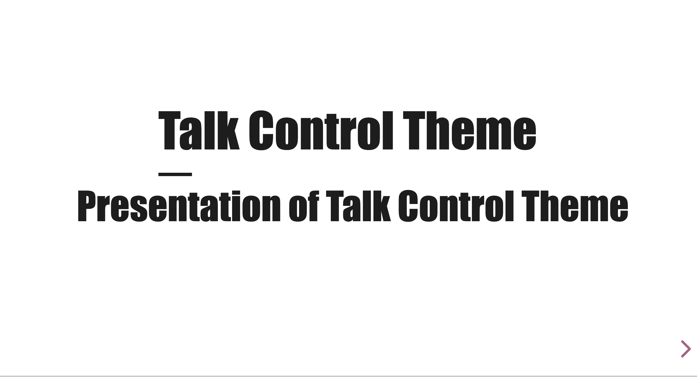
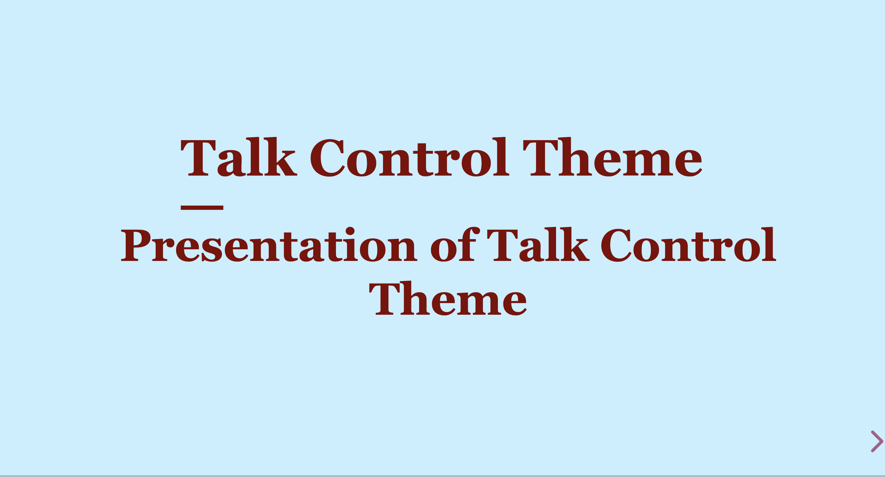
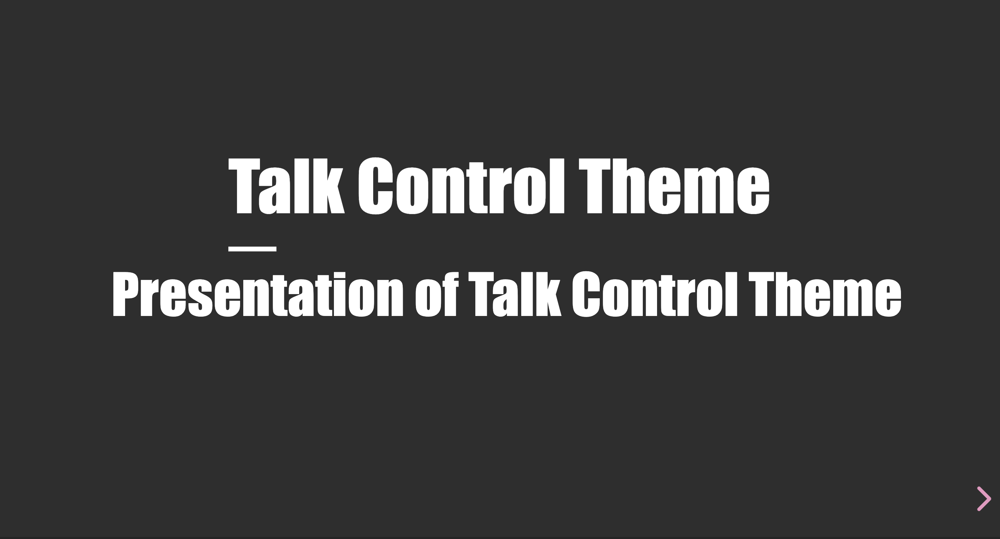

# Play with theme

You can use this extensions to create severals theme for your slides to match diferents programs or needs. For example, you want to create your custom theme for a deck... By default, the theme used is "talk-control"

To this end, you have two possibilities:

-   Use HTML attribute `data-theme`;
-   Use URL parameter `data-theme`.

## Example

In the demo, there is 2 additionnals themes add to show you the possibilities



-   [talk-control](https://talk-control-revealjs-extensions.netlify.app) (default theme)



-   [sample](https://talk-control-revealjs-extensions.netlify.app/?data-theme=sample#/) (demo theme)



-   [dark](https://talk-control-revealjs-extensions.netlify.app/?data-theme=dark#/) (demo theme)

## Configuration of theme

You need to add your custom CSS to the html

```html
<html>
    <head>
        <link
            rel="stylesheet"
            type="text/css"
            href="./theme-sample.css"
            id="theme-sample" />
    </head>
</html>
```

## CSS Configuration

In your css you have to override what you need in `body[data-theme='XXX']` selector where 'XXX' is the name of you theme. Due to nesting support in browsers, you can add all override you need in this selector.

## Custom properties (CSS Variables)

By default the theme offers you severals custom properties to override the main elements of your deck. So you can easily define new values for it in your theme to change for your needs. You can see [here](../src/scss/theme/talk-control-custom-properties.scss) the list of custom properties available.

### RevealJS custom properties

If you want to complete your theming, RevealJS allows you also to custumize some aspects of Reveal. You can find the list of RevealJS custom properties [here](https://github.com/hakimel/reveal.js/blob/master/css/theme/template/exposer.scss)

### SASS Override

For the moment SASS Overriding is not available.

## Custom background keys

You can define background (images, colors, gif, videos, ...) that will be always there for a kind of slide. To do this, you will have to specify in the ThemeInitializer.init method the `tcCustomBackgroundOptions` option.

In your markdown :

```markdown
<!-- .slide: class="orange-slide" -->

# Here an orange slide

We use a Hash notation as parameter passed in initializer

##==##

<!-- .slide: class="transition transition-wall" -->

# Compatible with transitions or any other class

## Here we set an image
```

Here is the configuration to set to the initializer to have this behaviour
tcCustomBackgroundOptions :

```javascript
tcCustomBackgroundOptions: {
    basePath: '/assets/images/', // Base path (according to /) where the images, videos, gif, will be found
    mapBackgrounds: (theme) => { // function that gives you the theme to do some specifics
        return {
            'orange-slide': '#f9cb9c', // Here, same color for all the slides with 'orange-slide' class
            'transition-wall': theme === 'dark' ? 'party.jpg' : 'wall.jpg', // Here a diferent image according to the theme if 'transition-wall' is set as class
        };
    },
},
```

You can also specify existing class (`transition`, `speaker-slide`,...) for custom backgrounds

# Setting a default theme if severals availables

If you have define your own override and you want it as default theme without passing it as parameter or as html attribute, simply set it in option of the initializer method :

```javascript
tcThemeOptions: {
    defaultTheme: 'sample'
},
```

# Add my custom CSS ?

You can still continue to add your custom CSS if needed in order to add specifics styles for your deck
